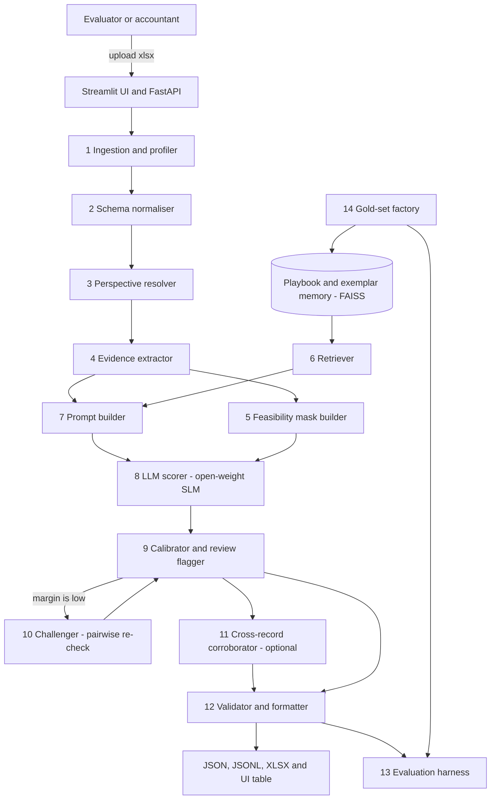
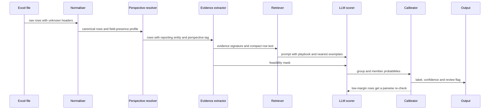
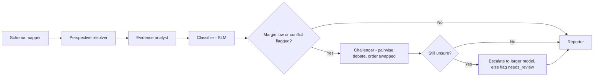
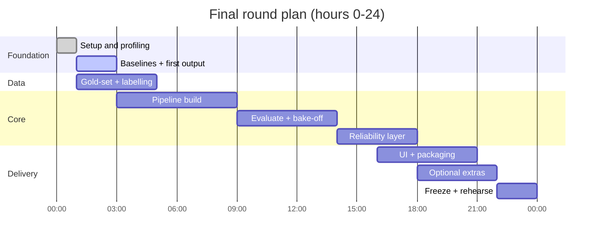

# VouchIQ

**Evidence-grounded voucher classification for Indian accounting data, driven by open-weight small language models.**

| | |
|---|---|
| **Event** | Hacktober Fest — Open Source AI Hackathon (organized by Elevate) |
| **Round** | Qualifier — README-only technical proposal |
| **Selected challenge** | Challenge 4 — *VYOM+ Intelligent Voucher Classification Using Open-Source LLMs* |
| **Team** | CodeCarto |
| **Repository** | `vouchiq` (fresh repo, README-only for qualifier) |
| **Engine** | `vouch-engine` — offline classification runtime (ingest → evidence → SLM scorer → calibrator) |
| **Planned license** | Apache-2.0 |
| **Repository status** | Contains only `README.md`, as the qualifier requires. All implementation happens in the final hackathon. |

### At a glance

| | |
|---|---|
| **Input** | An Excel file of structured transactions where the voucher type is deliberately missing |
| **Output** | For every row: one of 27 voucher categories, a calibrated confidence, the evidence behind the decision, and a `needs_review` flag |
| **Not in scope** | OCR and invoice extraction (explicitly excluded by the challenge) |
| **Primary intelligence** | An open-weight small language model (default: Qwen3.5-4B, Apache-2.0), chosen by a measured bake-off against Gemma 4 E4B and Qwen3.5-9B |
| **Key ideas** | (1) Resolve *whose books these are* before reasoning. (2) Code supplies evidence; the LLM supplies the verdict. (3) Probabilities, not just labels, so uncertainty is honest. (4) A gold-set factory because no labels are provided. |
| **Runs** | Fully offline on a single laptop-class machine (minimum 8 GB RAM CPU-only; recommended 16 GB RAM + 6 GB VRAM GPU); no proprietary API anywhere in the decision path |

### Contents

1. [Project Name](#1-project-name)
2. [Problem Statement](#2-problem-statement)
3. [Project Overview](#3-project-overview)
4. [Proposed Solution](#4-proposed-solution)
5. [Objectives](#5-objectives)
6. [Target Users / Use Case](#6-target-users--use-case)
7. [Open-Source AI Technology Selected](#7-open-source-ai-technology-selected)
8. [Why This Technology Was Selected](#8-why-this-technology-was-selected)
9. [AI's Role in the System](#9-ais-role-in-the-system)
10. [System Architecture](#10-system-architecture)
11. [Component-Level Architecture](#11-component-level-architecture)
12. [Data / Information Flow](#12-data--information-flow)
13. [Agentic Workflow](#13-agentic-workflow)
14. [Technology Stack](#14-technology-stack)
15. [Expected Features](#15-expected-features)
16. [Implementation Approach](#16-implementation-approach)
17. [Expected Final Output](#17-expected-final-output)
18. [Future Scope / Scalability](#18-future-scope--scalability)
19. [Open-Source Dependencies / Components](#19-open-source-dependencies--components)
20. [Expected Challenges and Mitigation](#20-expected-challenges-and-mitigation)

Appendices: [A. Label playbook](#appendix-a--label-playbook) · [B. Evaluation protocol](#appendix-b--evaluation-protocol) · [C. Anticipated reviewer questions](#appendix-c--anticipated-reviewer-questions) · [D. References](#appendix-d--references)

---

## 1. Project Name

**VouchIQ** — *Voucher + IQ*. Repository name: `vouchiq`. Team: **CodeCarto**. Engine name: **VouchEngine** (`vouch-engine`).

> **One-line pitch:** Give VouchIQ a spreadsheet of transactions with the voucher type missing, and it returns the right one of 27 voucher categories for every row — with a confidence score, the evidence it relied on, and an honest "needs review" flag when the data is genuinely ambiguous — entirely on local, open-weight models.

---

## 2. Problem Statement

> **Selected track: Challenge 4 — VYOM+ Intelligent Voucher Classification Using Open-Source LLMs (not OCR / not Challenge 3).** Input is structured `.xlsx` with voucher-type missing; output is voucher category per row.

### 2.1 The real-world problem

Every GST-registered business in India turns commercial events into **vouchers** before they reach the books, the GST returns and the audit. As of 30 June 2026 India had about **1.67 crore active GST taxpayers**, of which **76.9% are proprietorships**, and **192.27 crore returns** have been filed since July 2017 [[D1]](#appendix-d--references). Accounting software organises this work around predefined voucher types — TallyPrime ships **24** of them [[D2]](#appendix-d--references).

In practice the data does not arrive labelled. ERP exports, billing-app dumps, marketplace settlements, shopkeeper Excel sheets and CA-firm bulk uploads all record *what happened* but not *which voucher it is*. A bookkeeper then decides row by row, reading seller, buyer, items, tax, payment mode and reference fields **together**. This is slow, inconsistent between people, and the cost of a wrong decision is real:

- A sales return booked as a sale overstates outward supplies. A purchase return booked as a purchase overstates input tax credit.
- A delivery note booked as an invoice double-counts stock movement.
- A bank-to-bank transfer booked as a payment inflates expenses and breaks reconciliation.
- Reviewers spend their time re-checking rows that were never really ambiguous.

The commercial tools that automate parts of this (for example TallyPrime's *Docs by Ira* and Vyapar TaxOne) concentrate on extracting data from documents and statements and turning it into vouchers inside accounting software such as Tally [[D3]](#appendix-d--references). Their classification logic is proprietary: it cannot be inspected, benchmarked or run privately by a small CA firm.

### 2.2 Why it is genuinely hard

| # | Difficulty | Why a simple approach fails |
|---|---|---|
| 1 | **Perspective dependence** | The same document is a *Purchase* for one party and a *Sales* for the other. A row alone does not say which party is "us". |
| 2 | **Look-alike classes** | Purchase vs Sales, Purchase Return vs Purchase, Contra vs Payment, Journal vs Expense, Receipt Note vs Material In. Keywords overlap; the *relationship between fields* differs. |
| 3 | **Overlapping label space** | By our reading, 22 of the 27 target labels coincide with TallyPrime predefined voucher types. The other five (Import, Export, Expense, Advance / Prepayment, Other / Miscellaneous) describe the *nature* of a transaction rather than a voucher type, so an import is usually also a purchase and an advance is usually also a payment. Any honest solution needs an explicit precedence policy (see §4.4). |
| 4 | **Sparse, uneven fields** | A payroll row has no tax. An attendance row has no money. A stock journal has no party. Missing fields are *signals*, not just gaps. |
| 5 | **Unseen schema** | The hidden dataset's column names, date formats, Indian digit grouping (`1,23,456.00`) and sign conventions for returns are unknown in advance. |
| 6 | **No labelled data** | The provided Excel file has the voucher column removed on purpose. We must build our own evaluation or we cannot measure anything. |

### 2.3 Why existing approaches fall short

| Approach | What it does well | Why it is not enough here |
|---|---|---|
| Keyword / regex rules | Fast, transparent | Brittle ("return" also appears in "return of advance"); cannot reason about perspective or field combinations |
| Classical ML (TF-IDF + logistic regression, gradient boosting) | Excellent with thousands of labelled rows | No labels are provided; fixed schema; weak on rare classes such as Physical Stock or Job Work orders |
| Hosted LLM API | Strong zero-shot reasoning | Financial and GST data leaves the premises; per-row cost; unversioned behaviour; the challenge forbids a proprietary API as the primary engine |
| Closed commercial automation | Polished workflow | Not open, not auditable, not reproducible by the community |

### 2.4 Formal task definition

**Input.** A spreadsheet `D = {r_1 … r_N}`. Each row is a partial assignment over a heterogeneous set of fields (parties, document numbers and dates, items, quantities, taxable value, GST, discounts, freight, payment details, currency, import/export details, payroll details, debit/credit details, return details, order and delivery references, other metadata).

**Output.** For each row: a voucher type `ŷ_i` from the 27-label set, a calibrated confidence `c_i ∈ [0,1]`, an optional short explanation, and a `needs_review` flag.

**Objective.** Maximise macro-F1 and per-class recall under (a) missing fields, (b) schema variation, and (c) a fixed latency and compute budget — with the primary decision made by an open-weight LLM or SLM.

### 2.5 Scope and assumptions

| In scope | Out of scope (stated honestly) |
|---|---|
| Row-level voucher classification; calibrated confidence; evidence trace; reproducible evaluation; evaluator-friendly UI | OCR and invoice extraction; ledger / Dr-Cr prediction; GST return filing; pushing vouchers into Tally (all listed under Future Scope) |

**Assumptions to confirm with the organisers** (the design degrades gracefully if any is wrong):

- **A1.** The file is one flat sheet; each row is one transaction or document.
- **A2.** Rows come from one reporting entity's books or from a small number of entities (this drives the Perspective Resolver).
- **A3.** The voucher-type column is absent and no labelled sample is provided. If a sample *is* provided we use it for retrieval and calibration immediately.
- **A4.** Output must be machine-readable; the minimum record is `{"invoice_number": …, "voucher_type": …}`.
- **A5.** Where two labels both describe a row (for example an import that is also a purchase), the organisers' intended label is the *more specific* one. We treat this as an explicit, versioned policy rather than a hidden bias.

---

## 3. Project Overview

VouchIQ is an offline pipeline plus a small web UI. It reads an Excel file, maps unknown column headers onto a canonical schema, works out whose books the data belongs to, extracts compact *accounting evidence* from every row, and then asks an open-weight language model to choose the voucher type. The model's answer is read as a **probability distribution** over the 27 labels, not as free text, so confidence is measurable, calibratable and testable.

**Three ideas make it different:**

1. **Perspective first.** Before any reasoning, VouchIQ infers which party is the reporting entity (by name/GSTIN frequency across both party columns and by invoice-number-series patterns). "Seller is us" versus "buyer is us" is the single most informative fact for Purchase vs Sales and for the return and import/export pairs.
2. **Code gives evidence, the LLM gives the verdict.** Deterministic code never outputs a voucher label. It produces readable evidence tags (`PERSPECTIVE: seller`, `DOC_SIGN: negative`, `CURRENCY: USD`, `LEDGER_PAIR: bank-to-cash`) and a soft feasibility mask. The model reasons over the full context and decides.
3. **Honest uncertainty and honest evaluation.** Calibrated confidence, a two-stage cascade that spends extra compute only on low-margin rows, and a **gold-set factory** that builds a labelled evaluation set (synthetic, perturbed, and human-verified with inter-annotator agreement) because the challenge provides none.

**What the evaluator will see:** upload an `.xlsx`, get a predictions table with confidence and evidence per row, download JSON/XLSX, and open an evaluation report (accuracy, macro-F1, per-class precision/recall/F1, confusion matrix, calibration curve, latency) generated by one reproducible command.

---

## 4. Proposed Solution

### 4.1 Design principles

| Principle | Consequence |
|---|---|
| **P1. The LLM decides.** | The primary classification intelligence is an open-weight model, as the challenge requires. Rules never assign labels. |
| **P2. Resolve perspective before reasoning.** | A dedicated component settles "whose books?" so the model does not have to guess. |
| **P3. Probabilities, not strings.** | The model is read through constrained label-code scoring, giving calibrated confidence and a measurable margin. |
| **P4. Spend compute where uncertainty is.** | Most rows finish in one cheap pass. Only low-margin rows go to a pairwise re-check or a larger model. |
| **P5. Evaluate honestly.** | Leave-template-out splits, human-verified gold rows with Cohen's kappa, ablations, and reported misses. |

### 4.2 Pipeline in one table

| Stage | What it does | Why it exists |
|---|---|---|
| 1. Ingest and profile | Reads `.xlsx`, detects header row, types and per-column fill rates | Robustness to messy sheets |
| 2. Normalise schema | Maps arbitrary headers and value formats to a canonical schema | The hidden dataset's columns are unknown |
| 3. Resolve perspective | Infers the reporting entity and tags each row seller / buyer / neither / unknown | Purchase vs Sales depends on it |
| 4. Extract evidence | Computes readable accounting signals per row | Gives the model structured context it cannot easily derive from raw numbers |
| 5. Build feasibility mask | Soft-penalises labels that are logically impossible given missing or present fields | Prevents silly answers (for example Payroll with no employee data) without overriding strong evidence |
| 6. Retrieve exemplars | Fetches a playbook excerpt and the nearest labelled examples | Few-shot grounding without fine-tuning |
| 7. Score with the LLM | Reads group and member probabilities in two single-token steps | Fast, constrained, calibratable |
| 8. Calibrate and flag | Temperature-scales probabilities; flags low-confidence rows | Honest uncertainty; handles ambiguous records |
| 9. Challenge | Pairwise re-check of the two leading labels (position-swapped), optionally on a larger model | Targets look-alike pairs at low cost |
| 10. Corroborate (optional) | Uses cross-row references (invoice, order, payment references) as a weak prior | Captures chains such as order → delivery → invoice → return |
| 11. Validate and emit | Enforces the output schema; writes JSON, JSONL and XLSX | Programmatic evaluation |

### 4.3 Hierarchical label coding

The 27 labels are organised into **seven groups**. The model makes two single-token decisions — group, then member — instead of one 27-way choice. This keeps decoding to two steps, improves calibration, and lets us analyse confusion at group level first.

| Group | Name | Members |
|---|---|---|
| **A** | Trade invoices | A1 Purchase · A2 Sales · A3 Import · A4 Export |
| **B** | Returns and rejections | B1 Purchase Return / Debit Note · B2 Sales Return / Credit Note · B3 Rejection Out · B4 Rejection In |
| **C** | Money movement | C1 Payment · C2 Receipt · C3 Contra · C4 Advance / Prepayment |
| **D** | Non-cash ledger and miscellaneous | D1 Journal · D2 Expense · D3 Other / Miscellaneous |
| **E** | People | E1 Salary / Payroll · E2 Attendance |
| **F** | Orders and movement documents | F1 Purchase Order · F2 Sales Order · F3 Receipt Note · F4 Delivery Note · F5 Material In · F6 Material Out · F7 Job Work In Order · F8 Job Work Out Order |
| **G** | Stock accounting | G1 Stock Journal · G2 Physical Stock |

Final label probability is `P(group) × P(member | group)`, evaluated for the top two groups so that cross-group confusions (for example Purchase vs Purchase Order) are still ranked correctly.

### 4.4 Label precedence policy (v1, versioned and overridable)

Because five labels overlap with others by design, the policy is written down, tested, and can be replaced the moment the organisers clarify their intent.

| Overlap | v1 policy | Evidence that triggers the specific label |
|---|---|---|
| Import vs Purchase | Specific wins | Foreign supplier or currency, bill of entry, port code, customs duty, IEC, CIF/FOB |
| Export vs Sales | Specific wins | Foreign customer or currency, shipping bill, LUT / bond, port code, Incoterms |
| Expense vs Purchase | Overhead and service wins when no stock items exist | Service / SAC-type descriptions (rent, utilities, repairs, professional fees), no inventory items |
| Advance vs Payment / Receipt | Advance wins when money moves *without* a settling invoice | "Advance", "on account", "deposit", "token", "prepaid"; no invoice reference |
| Purchase Return / Debit Note vs Rejection Out | Debit Note is value-bearing and references an invoice; Rejection Out is quantity-level and references a receipt note | Reason codes; presence of value and tax reversal vs quantity-only movement |
| Other / Miscellaneous | Chosen only if it is genuinely the model's top label | Never used as a dumping ground for low confidence; low confidence raises `needs_review` instead |

The complete label playbook, with cues and look-alike pairs for all 27 labels, is in [Appendix A](#appendix-a--label-playbook).

---

## 5. Objectives

All numeric figures below are **targets to be measured and reported honestly in the final round, including any misses**; they are not claims.

| # | Objective | Metric | Target |
|---|---|---|---|
| O1 | Accurate classification on unseen records | Macro-F1 on the human-verified gold set | ≥ 0.85 |
| O2 | Separate look-alike classes | Pairwise F1 on the 11 confusable pairs (Appendix A) | ≥ 0.80 per pair |
| O3 | Trustworthy confidence | Expected calibration error (ECE) after calibration | ≤ 0.08 |
| O4 | Graceful degradation | Macro-F1 drop when 30% of non-essential fields are randomly removed | ≤ 10 points |
| O5 | Schema robustness | Macro-F1 on header-renamed and format-perturbed copies of the gold set | within 5 points of the clean set |
| O6 | Efficient inference | Throughput and p95 latency per row on one consumer machine | measured and reported; ≥ 85% of rows resolved in the single-pass tier |
| O7 | Reproducibility | One command regenerates every metric and plot from fixed seeds and pinned versions | pass / fail |
| O8 | Privacy and openness | No network call and no proprietary model in the decision path | pass / fail |

**Non-goals:** beating a fine-tuned frontier model on every row; OCR; building a full accounting system.

---

## 6. Target Users / Use Case

### 6.1 Personas

| Persona | Pain today | What VouchIQ gives them |
|---|---|---|
| **CA firms and bookkeepers** handling many small clients | Bulk exports arrive without voucher types; manual triage is slow and varies by person | Pre-classified rows with confidence, so humans review only what is genuinely uncertain |
| **SME owners using spreadsheets or billing apps** | Cannot afford a full-time accountant; mistakes surface at GST filing | A private, offline classifier that runs on their own machine |
| **ERP / accounting-automation vendors and integrators** | Need a voucher-classification step between extraction and voucher creation | An open, auditable, swappable-model component |
| **Auditors and finance controllers** | Need to spot mis-typed historical vouchers | Retro-audit mode: compare recorded type with predicted type and flag disagreements |
| **Hackathon evaluators / data scientists** | Need a fair, programmatic way to compare submissions | Deterministic JSON/XLSX output and a one-command evaluation report |

### 6.2 Use cases

| Use case | Input | Output | Value |
|---|---|---|---|
| **UC1. Bulk import triage** | Unlabelled `.xlsx` of mixed transactions | Voucher type, confidence, `needs_review` | Cuts manual classification to the uncertain minority |
| **UC2. Bridge after invoice extraction** | Structured fields produced by an OCR / extraction pipeline | Voucher type per document | Closes the gap between "extracted" and "voucher-ready" |
| **UC3. Retro-audit** | A ledger export that already has voucher types | Rows where recorded and predicted types disagree | Finds mis-posted vouchers before filing or audit |
| **UC4. Bank-statement style rows** | Payments, receipts and transfers | Payment / Receipt / Contra / Advance split | Removes a classic reconciliation error |

---

## 7. Open-Source AI Technology Selected

| Role | Selection | License | Status |
|---|---|---|---|
| **Primary classifier (SLM)** | **Qwen3.5-4B** (instruct), 4-bit quantised for local inference | Apache-2.0 | Default |
| **Bake-off challengers** | **Gemma 4 E4B** (4.5B effective parameters) · **Qwen3.5-9B** · fallback **Qwen3.5-2B** | Apache-2.0 | Compared on the gold set; the winner is frozen before submission |
| **Escalation tier** | Qwen3.5-9B Q4 (or the bake-off runner-up) for low-margin rows only | Apache-2.0 | Optional; fits 6 GB VRAM in Q4 |
| **Embeddings** | multilingual-e5-small (alternative: bge-small-en-v1.5) | MIT | Retrieval and header matching; multilingual for pan-India narrations |
| **Vector search** | FAISS (in-memory) | MIT | Exemplar retrieval |
| **Local inference** | llama.cpp (GGUF) as primary; vLLM as optional GPU server | MIT / Apache-2.0 | Constrained decoding, log-probabilities, prefix caching |
| **Optional adaptation** | PEFT + TRL (QLoRA), or Unsloth | Apache-2.0 | Plan B, feasible on 16 GB RAM + 6 GB VRAM GPU for 4B LoRA |

**Selection rule.** Both model families are supported behind a small adapter (`--model qwen3.5-4b | gemma-4-e4b | qwen3.5-9b`). Default is Qwen3.5-4B for speed; Gemma 4 E4B is the co-supported challenger for multilingual rows. We run the same gold set through every candidate on a reference laptop-class machine (minimum 8 GB RAM CPU-only; recommended 16 GB RAM + 6 GB VRAM GPU) and freeze the winner by macro-F1, p95 latency and memory. The choice is driven by measurement, not popularity, which is the standard the hackathon sets in its own guidelines.

---

## 8. Why This Technology Was Selected

### 8.1 Why a small language model, not a large one

- **Latency and cost.** A classification verdict needs only two tokens of output. A 4B-class model at Q4 processes a few hundred tokens of context in well under a second on a 6 GB VRAM laptop GPU (and runs quantised on CPU as fallback). A 70B-class model would be slower without adding information the evidence tags do not already carry. We will measure this in the bake-off on the reference machine rather than assume it.
- **Fit to the task.** The hard part is reasoning over *evidence already made explicit*, not recalling world knowledge. A small model given clean evidence tags and nearest exemplars performs the right kind of work.
- **Efficiency is judged.** The challenge lists inference speed and computational efficiency among evaluation criteria.

### 8.2 Why these particular models

- **Qwen3.5 small series (0.8B, 2B, 4B, 9B).** Released under Apache-2.0 with LoRA and full fine-tuning support on consumer-grade graphics cards [[D5]](#appendix-d--references). The size ladder lets us trade accuracy for speed without changing the pipeline. Q4 quantised 4B runs comfortably on a laptop-class machine (minimum 8 GB RAM CPU-only; recommended 16 GB RAM + 6 GB VRAM); 9B Q4 is the escalation tier on the same class of GPU.
- **Gemma 4 E4B.** Released 31 March 2026 (weights) / announced 2 April 2026 under Apache-2.0, with 140+ language coverage [[D4]](#appendix-d--references). Co-supported alongside Qwen because VouchIQ is built as a product for pan-India books: English, Hindi, Hinglish, Marathi and code-mixed narrations, with multilingual-e5 embeddings as the retrieval backbone. Both families stay swappable via `--model`.
- Both families are fully open-weight and commercially usable, so the whole solution can ship under Apache-2.0.

### 8.3 Why a hybrid (evidence + LLM), not pure ML or pure prompting

| Alternative | Why we did not choose it |
|---|---|
| Pure rules | Cannot cope with ambiguity or unseen phrasing; brittle |
| Supervised gradient boosting | Needs labels we do not have; would learn our synthetic assumptions rather than real semantics |
| Raw-row prompting of an LLM | Models are unreliable at inferring perspective and at arithmetic-style checks from raw columns; no calibrated confidence |
| Fine-tuning first | Risks overfitting to synthetic data; kept as optional Plan B and judged only on held-out human-verified rows |
| **Evidence + retrieval + constrained LLM scoring** | Uses the LLM for semantic reasoning, code for facts, and keeps everything measurable |

### 8.4 Why an open-source approach suits this problem

- **Privacy.** Invoices and GSTINs are sensitive. Everything runs locally; nothing is sent to a third party.
- **Cost at volume.** A CA practice serving many clients can accumulate very large row counts; per-row API fees do not scale for small practices.
- **Auditability and reproducibility.** Pinned weights, fixed prompts and greedy decoding give the same answer tomorrow. Accountants and auditors can inspect the playbook and the evidence behind every label.
- **Adaptability.** Per-firm exemplars and optional LoRA adapters let a firm teach the system its own conventions.
- **Alignment with the event.** Hacktoberfest 2026 centres on building with open-weight models, open-source agents and agent skills [[D6]](#appendix-d--references); this project does all three (open model, bounded agentic workflow, and a reusable skill pack).

---

## 9. AI's Role in the System

**The rule: no deterministic component ever outputs a voucher label.** Code prepares facts; the model decides.

| Task | Handled by | Why |
|---|---|---|
| Understand what the transaction *means* across many fields | **LLM** | Semantic, multi-field reasoning is exactly what rules and tabular models do poorly without labels |
| Choose group and member (the verdict) | **LLM** — read as probabilities | The primary classification engine, as the challenge requires |
| Resolve a close call between two look-alike labels | **LLM** — pairwise re-check, position-swapped | Reduces position bias and focuses compute |
| Explain the decision in one or two sentences | **LLM** — on demand only | Keeps the main path fast |
| Read column headers and value formats | Code (alias dictionary, fuzzy matching, small embedding model) | Deterministic and cheap |
| Infer which party is "us" | Code (frequency and pattern statistics) | A statistical fact about the file, not a judgement |
| Compute evidence tags and the feasibility mask | Code | Facts, presence/absence, arithmetic |
| Calibrate and flag uncertainty | Code over LLM probabilities | Turns raw probabilities into trustworthy confidence |

**Necessity test.** Remove the LLM and the system produces evidence tags and a mask but **no label at all**. The ablation ladder in [Appendix B](#appendix-b--evaluation-protocol) also measures how much each non-LLM component adds, so the contribution of the model and of the surrounding engineering are both visible.

---

## 10. System Architecture



### 10.1 Layers

| Layer | Components | Responsibility |
|---|---|---|
| **Interface** | Streamlit UI, FastAPI endpoint | Upload, inspect, download; programmatic access |
| **Data preparation** | Ingestion, schema normaliser, perspective resolver | Turn any sheet into canonical rows with a known viewpoint |
| **Evidence and knowledge** | Evidence extractor, feasibility mask, playbook and exemplar memory, retriever | Supply facts and grounding to the model |
| **Intelligence** | LLM scorer, challenger, optional escalation model | Produce the verdict as probabilities |
| **Reliability** | Calibrator, review flagger, validator | Honest confidence and clean output |
| **Quality** | Gold-set factory, evaluation harness | Build the evaluation data and prove the numbers |

### 10.2 Deployment view

One machine, offline. The **VouchEngine** (`vouch-engine`) runs as two Docker Compose services: `app` (UI, API and pipeline) and `llm` (a local llama.cpp server holding the quantised model). A vLLM service can replace `llm` when a stronger GPU is available. Weights are mounted from a local volume, so no network access is needed at inference time. Minimum: 8 GB RAM CPU-only. Recommended: 16 GB RAM + 6 GB VRAM GPU.

---

## 11. Component-Level Architecture

Each component has a single job, a typed input and output, and a stated fallback.

| # | Component | Purpose and key logic | Why it is needed | Fallback if it fails |
|---|---|---|---|---|
| C1 | **Ingestion and profiler** | Reads `.xlsx` with openpyxl and pandas; detects the header row; infers column types; records per-column fill rate | Real sheets have title rows, merged cells and blanks | Treat first non-empty row as header; surface a warning |
| C2 | **Schema normaliser** | Maps headers to a canonical schema using (1) an alias dictionary, (2) RapidFuzz string similarity, (3) value-pattern inference (GSTIN pattern, dates, currency codes, HSN/SAC shapes), (4) embedding similarity as a last resort. Normalises Indian digit grouping, dates and sign conventions | The hidden dataset's schema is unknown | Unmapped columns are kept as free-text "other metadata" and still shown to the model |
| C3 | **Perspective resolver** | Normalises party names and GSTINs, merges near-duplicates, and finds the entity that appears across both party columns far more often than any other — the reporting entity. Secondary signal: **own-series detection** (our own invoice numbers share a prefix and increase sequentially; supplier invoice numbers come in many formats). Output per row: `seller`, `buyer`, `neither`, or `unknown` | Purchase vs Sales and the return and trade pairs hinge on it | `unknown` is passed to the model, which then leans on other cues |
| C4 | **Evidence extractor** | Computes readable tags (see 11.1) from canonical fields | Gives the SLM structured context and makes decisions explainable | Missing evidence is itself tagged (`NO_PARTY`, `NO_ITEMS`) |
| C5 | **Feasibility mask builder** | For each label, lists required and contradicting evidence; produces a soft penalty vector (for example 0.05× probability, never a hard zero except for logical impossibilities) | Stops absurd answers without overriding strong evidence | Mask disabled by flag; ablation measures its value |
| C6 | **Retriever and memory** | FAISS index over (a) the playbook, split by label, and (b) labelled exemplars from the gold-set factory (and any organiser-provided sample). Retrieves the top-k nearest *evidence-tag signatures* with class balancing | Few-shot grounding without fine-tuning; adapts to new conventions by adding exemplars | Fall back to a fixed class-balanced exemplar set |
| C7 | **Prompt builder** | Assembles a prompt from the blocks in 11.2; the static prefix is cached | Reproducible prompts; prefix caching keeps per-row cost low | Shorter prompt variant if context is tight |
| C8 | **LLM scorer** | Runs the open-weight SLM with greedy decoding. Reads next-token log-probabilities over group codes (A–G), then over member codes for the top two groups. Probabilities are multiplied by the mask and renormalised | Constrained, fast, calibratable | Grammar-constrained JSON generation with log-probabilities |
| C9 | **Calibrator and review flagger** | Temperature scaling fitted on a held-out gold split; computes margin (top-1 minus top-2) and entropy; sets `needs_review` | Trustworthy confidence; handles ambiguous records | Uncalibrated softmax with a conservative threshold |
| C10 | **Challenger** | For rows whose margin is below a tuned threshold, runs a pairwise prompt on the top two labels twice (A/B order swapped), averages the preference, and optionally uses the larger model | Look-alike pairs are where errors concentrate; spend compute there only | Skip; keep first-pass answer |
| C11 | **Cross-record corroborator** (optional) | Builds a graph linking rows by shared invoice, order, payment and party references; adds a weak prior (for example a row that references an earlier sale and carries reversed values supports Sales Return) | Captures document chains that single-row reading misses | Disabled by flag; enabled only if the ablation shows a gain |
| C12 | **Validator and formatter** | Pydantic schema validation; guarantees one valid label per row; writes JSON, JSONL, XLSX | Programmatic evaluation | Emit `Other / Miscellaneous` with `needs_review` only if the model output is invalid (logged) |
| C13 | **Evaluation harness** | Computes accuracy, macro/micro/weighted F1, per-class precision/recall/F1, confusion matrix, pairwise F1, ECE, coverage-accuracy curve, robustness curves, latency and memory | The reproducible evaluation method the challenge asks for | — |
| C14 | **Gold-set factory** | Generates synthetic, perturbed and hard-negative rows with known labels; supports hand-labelling with double annotation | No labels are provided | — |
| C15 | **UI and API** | Upload, results table with filters, evidence and explanation drill-down, confusion matrix, download | Evaluator-friendly inspection | CLI output files |

### 11.1 Evidence families

| Family | Example tags |
|---|---|
| Perspective | `PERSPECTIVE: seller` · `PERSPECTIVE: unknown` |
| Document sign and structure | `DOC_SIGN: negative` · `HAS_ITEMS: yes` · `QTY_ONLY: no price` · `NO_INVOICE_NO` |
| Tax | `TAX: CGST+SGST` · `TAX: IGST` · `TAX: none` · `TAX_ARITHMETIC: consistent` |
| Money movement | `PAY_MODE: bank` · `LEDGER_PAIR: bank-to-cash` · `HAS_UTR_OR_CHEQUE: yes` |
| Cross-border | `CURRENCY: USD (foreign)` · `HAS_CUSTOMS_FIELDS: yes` · `HAS_SHIPPING_BILL: yes` |
| People | `EMPLOYEE_FIELDS: yes` · `PAY_PERIOD: yes` · `DEDUCTIONS: PF, ESI` · `ATTENDANCE_FIELDS: yes` |
| References | `REFS_INVOICE: SI/…` · `REFS_ORDER: yes` · `REFS_RECEIPT_NOTE: yes` |
| Narration cues | `CUE: "return", "damaged"` · `CUE: "advance"` · `CUE: "depreciation"` |

### 11.2 Prompt anatomy (illustrative)

| Block | Content | Cached across rows |
|---|---|---|
| 1. Role and rules | Task statement, output format, group and member code table | Yes |
| 2. Playbook digest | One compact paragraph per label with discriminating cues and look-alike warnings | Yes |
| 3. Policy notes | The precedence policy from §4.4 | Yes |
| 4. Retrieved exemplars | k nearest evidence-signature exemplars, class-balanced | No |
| 5. Target row | Canonical fields as compact `key: value` lines | No |
| 6. Evidence and mask note | Evidence tags and any strongly contradicted labels | No |
| 7. Answer prefix | `Group:` then `Member:` | No |

---

## 12. Data / Information Flow



### 12.1 Data contracts

| Hand-off | Payload | Guarantees |
|---|---|---|
| Ingestion → Normaliser | Raw table plus column profile | Header row identified; types inferred |
| Normaliser → Perspective | Canonical rows (typed fields, null where absent) | Numbers parsed; dates ISO; sign convention recorded |
| Perspective → Evidence | Rows plus `self_entity` and per-row perspective | Perspective in {seller, buyer, neither, unknown} |
| Evidence → Prompt / Mask | Tag list per row; penalty vector over 27 labels | Tags are human-readable; mask values in (0, 1] |
| Scorer → Calibrator | Group and member probabilities (top two groups) | Sums to 1 after renormalisation |
| Calibrator → Output | `voucher_type`, `confidence`, `needs_review`, optional `top_k` and `evidence` | Exactly one valid label per row |

### 12.2 Worked examples (illustrative, fictional data)

| Row (abridged) | Key evidence | Verdict |
|---|---|---|
| Seller *Sharma Traders* (self), buyer *Nagpur Agro Pvt Ltd*, invoice `SI/26-27/0412`, office chairs qty 10, taxable ₹50,000, CGST ₹4,500, SGST ₹4,500 | `PERSPECTIVE: seller` · `HAS_ITEMS: yes` · `TAX: CGST+SGST` · `TAX_ARITHMETIC: consistent` | **Sales** |
| Same parties, values negative, reference `SI/26-27/0398`, reason "damaged in transit" | `PERSPECTIVE: seller` · `DOC_SIGN: negative` · `REFS_INVOICE` · `CUE: damaged` | **Sales Return / Credit Note** |
| Debit account *HDFC Current*, credit account *Cash*, amount ₹2,00,000, no party, narration "cash deposited" | `LEDGER_PAIR: bank-to-cash` · `NO_PARTY` · `NO_ITEMS` | **Contra** |
| Employee `E-114`, month "Aug 2026", basic, HRA, PF, net pay; no tax | `EMPLOYEE_FIELDS` · `PAY_PERIOD` · `DEDUCTIONS: PF` · `TAX: none` | **Salary / Payroll** |
| Buyer is self, supplier in another country, currency USD, bill of entry and port code present | `PERSPECTIVE: buyer` · `CURRENCY: foreign` · `HAS_CUSTOMS_FIELDS` | **Import** (specific wins over Purchase) |

Example output record for the first row:

```json
{
  "row_id": 1,
  "invoice_number": "SI/26-27/0412",
  "voucher_type": "Sales",
  "confidence": 0.97,
  "needs_review": false,
  "top_k": [["Sales", 0.97], ["Delivery Note", 0.01], ["Export", 0.01]],
  "evidence": ["PERSPECTIVE: seller", "HAS_ITEMS: yes", "TAX: CGST+SGST", "TAX_ARITHMETIC: consistent"]
}
```

---

## 13. Agentic Workflow

VouchIQ uses a **bounded, deterministic multi-role workflow**, not a free-roaming agent. Each role has a typed input and output, a step budget and no external tools beyond local retrieval. This gives the benefits of agent orchestration — specialised roles, escalation, self-checking — without non-determinism or unbounded cost.



| Role | Input | Output | Budget |
|---|---|---|---|
| Schema mapper | Raw headers and sample values | Canonical mapping with confidence | One pass |
| Perspective resolver | Normalised party columns | Reporting entity and per-row perspective | One pass |
| Evidence analyst | Canonical row | Tags and feasibility mask | One pass |
| Classifier | Prompt with playbook, exemplars, evidence | Group and member probabilities | Two decoding steps |
| Challenger | Top-two labels, evidence for each | Averaged pairwise preference | Two short passes |
| Escalation model | Same prompt | Replacement probabilities | Only rows still uncertain, capped at a fixed share of rows |
| Reporter | Final probabilities | Label, confidence, flag, explanation on demand | One pass |

**Guardrails:** temperature zero; no tool access except the local retriever; per-row trace logged; an escalation cap per run; invalid outputs rejected by the validator and counted in the report.

**Reusable skill pack (bonus).** The label playbook and decision procedure are also packaged as an Agent Skill (a `SKILL.md` folder following the open Agent Skills format), so other agents can reuse Indian voucher-classification knowledge without running VouchIQ.

---

## 14. Technology Stack

| Layer | Technology | Purpose |
|---|---|---|
| Language | Python 3.11+ | Entire pipeline |
| Data | pandas, openpyxl | Excel ingestion and output |
| Validation | Pydantic | Typed contracts and output schema |
| String and header matching | RapidFuzz | Fuzzy header and party-name matching |
| Embeddings | sentence-transformers with multilingual-e5-small | Retrieval and last-resort header matching |
| Vector search | FAISS | Exemplar retrieval |
| LLM runtime | llama.cpp server (GGUF, 4-bit) · optional vLLM | Local inference, log-probabilities, grammar constraints, prefix caching |
| Models | Qwen3.5-4B (default) · Gemma 4 E4B · Qwen3.5-9B · Qwen3.5-2B | Classification and escalation |
| Calibration and metrics | scikit-learn | Temperature scaling, F1, confusion matrix, ECE |
| Optional stacking | LightGBM | Only if ablation shows value |
| Optional adaptation | PEFT, TRL, bitsandbytes (QLoRA) or Unsloth | Plan B fine-tuning |
| Backend | FastAPI | API endpoint |
| Frontend | Streamlit | Upload and inspection UI |
| Plots | matplotlib / Plotly | Confusion matrix, reliability and coverage curves |
| Packaging | Docker and Docker Compose | One-command offline run |
| Hygiene | pytest, ruff, pinned requirements, fixed seeds | Reproducibility |

---

## 15. Expected Features

Scope is prioritised so that a complete, demonstrable system exists early and optional items can be cut without breaking it.

| Priority | Feature |
|---|---|
| **Must** | Excel upload and header-robust ingestion |
| **Must** | Schema normaliser with alias, fuzzy and value-pattern mapping |
| **Must** | Perspective resolver |
| **Must** | Evidence extractor with readable tags |
| **Must** | Hierarchical constrained LLM scoring over all 27 labels |
| **Must** | JSON, JSONL and XLSX output in the required format |
| **Must** | One-command evaluation report (accuracy, macro-F1, per-class metrics, confusion matrix) |
| **Must** | Streamlit UI: results table, per-row evidence, download |
| **Should** | Retrieval-based few-shot grounding |
| **Should** | Feasibility mask |
| **Should** | Temperature-scaled confidence and `needs_review` flag |
| **Should** | Gold-set factory (synthetic, perturbed, hard negatives) and human-verified gold rows with Cohen's kappa |
| **Should** | Model bake-off report (accuracy, latency, memory) |
| **Should** | Pairwise challenger on low-margin rows |
| **Could** | Cross-record corroboration graph |
| **Could** | QLoRA adapter trained on the synthetic corpus, judged only on held-out human-verified rows |
| **Could** | Retro-audit mode (recorded type vs predicted type) |
| **Could** | Agent Skill pack of the label playbook |

---

## 16. Implementation Approach

### 16.1 Strategy

**Vertical slice first.** A complete but crude pipeline (ingest → zero-shot LLM → output file → metrics) exists within the first four hours. Every later hour improves a measured number; nothing is built that cannot be evaluated. Roles can be combined for smaller teams.

| Role | Focus |
|---|---|
| ML lead | Prompting, scoring, calibration, bake-off |
| Data and evaluation lead | Gold-set factory, hand-labelling, metrics |
| Backend and UI | Ingestion, normaliser, API, Streamlit, Docker |
| Domain and documentation | Playbook, label policy, README with real numbers, demo script |

### 16.2 Phases

| Phase | Hours | Deliverable | Exit criterion |
|---|---|---|---|
| P0 Setup | 0–1 | Environment, model download, repository skeleton, dataset profiling | Dataset loads; model answers a test prompt |
| P1 Baselines | 1–3 | Keyword baseline and raw-row zero-shot LLM baseline; first output file | End-to-end file produced |
| P2 Gold data (parallel) | 1–5 | Generator v1, hand-labelled gold rows, double annotation | ≥ 200 gold rows and a kappa figure |
| P3 Core pipeline | 3–9 | Normaliser, perspective resolver, evidence extractor, prompt builder, hierarchical scorer | Beats both baselines on the gold set |
| P4 Evaluate and iterate | 9–14 | Metrics, confusion analysis, exemplar and prompt tuning, model bake-off | Model chosen and frozen |
| P5 Reliability | 14–18 | Calibration, review flag, mask tuning, challenger | ECE and coverage-accuracy curve reported |
| P6 UI and packaging | 16–21 | Streamlit app, Docker Compose, docs | Fresh clone runs offline from one command |
| P7 Optional | 18–22 | Cross-record graph, QLoRA, skill pack | Kept only if ablation shows a gain |
| P8 Freeze and rehearse | 22–24 | Final run, README updated with real numbers, demo script | Submission artefacts complete |

> The table above is the source of truth. The diagram below mirrors it (GitHub-safe dates).



### 16.3 If the final is shorter than expected

If only 8–12 hours are available, we keep every **Must** item plus retrieval, calibration and the bake-off, and cut the challenger, cross-record graph, QLoRA and skill pack. The order of the phases already supports this cut.

### 16.4 Compute plan (minimum vs recommended)

| Plan | Hardware | Approach | RAM / VRAM estimate |
|---|---|---|---|
| **A (default)** | Recommended: 16 GB RAM + 6 GB VRAM GPU laptop | 4-bit quantised 4B model via llama.cpp or vLLM; prefix caching; no training; both Qwen3.5-4B and Gemma 4 E4B supported via `--model` flag | Qwen3.5-4B Q4_K_M ~2.5 GB / Gemma 4 E4B Q4 ~3 GB + embeddings (~0.5 GB) + FAISS in-RAM; comfortable headroom |
| **B (optional)** | Same recommended GPU | QLoRA (rank 8–16) on the synthetic corpus for 4B; evaluated only on held-out human-verified rows | 4B QLoRA fits 6 GB VRAM with gradient checkpointing; skipped if time is short |
| **C (fallback)** | CPU-only if GPU fails | Qwen3.5-2B Q4 via llama.cpp; larger share of rule-derived evidence in the prompt | ~2 GB RAM, slower but functional |

### 16.5 Evaluation approach (summary; full protocol in Appendix B)

Splits are disjoint by **scenario template** and by **perturbation family**, so reported results are not inflated by near-duplicates. We report synthetic-test, human-verified gold and (if provided) organiser-sample results **separately**. An ablation ladder shows what each component contributes.

### 16.6 Definition of done

A fresh clone starts offline with one command; the evaluator can upload a file and download predictions; one command regenerates every metric and plot; every number in the README came from that command.

---

## 17. Expected Final Output

| Artefact | Description |
|---|---|
| **Public GitHub repository** | Source code under Apache-2.0, pinned requirements, Dockerfile and Compose file, model card for the chosen model and adapters |
| **Predictions** | `predictions.jsonl` and `predictions.xlsx` with the minimum required fields plus confidence, flag and evidence |
| **Evaluation report** | Accuracy, macro/micro/weighted F1, per-class metrics, confusion matrix, pairwise F1, calibration curve, coverage-accuracy curve, robustness curves, latency and memory, plus the bake-off and ablation tables |
| **Web UI** | Upload, results with filters, evidence and explanation drill-down, download |
| **Reproduction script** | One command that regenerates every figure and table from fixed seeds |
| **Gold-set factory and playbook** | Documented scenario templates, perturbation recipes and the versioned label policy |
| **Agent Skill pack (bonus)** | Label playbook packaged as a reusable skill |

**Minimum record format** (exactly as the challenge specifies):

```json
{ "invoice_number": "INV-2026-1042", "voucher_type": "Purchase" }
```

**Extended record** (optional): adds `row_id`, `confidence`, `needs_review`, `top_k`, `evidence`, and a short `explanation` when requested.

---

## 18. Future Scope / Scalability

| Direction | Description |
|---|---|
| **Bridge to invoice extraction** | Feed the output of an open OCR / document-understanding pipeline (for example PaddleOCR-VL, Apache-2.0) straight into VouchIQ to make "scan → voucher type" one flow |
| **Voucher creation** | Predict ledgers, Dr/Cr sides and GST treatment, then generate Tally-compatible import XML |
| **Human-in-the-loop learning** | Accountant corrections are stored as new exemplars immediately and used for periodic per-firm LoRA updates |
| **Retro-audit product** | Continuous check of posted vouchers against predicted types before GST filing |
| **Multilingual narrations (product-ready)** | Pan-India support: English, Hindi, Hinglish, Marathi and code-mixed narrations via Gemma 4 (140+ langs) + Qwen3.5 multilingual + multilingual-e5 embeddings; perturbation tests cover transliteration and mixed-language rows |
| **Edge deployment** | Distil to a sub-1B model for low-end machines |
| **Throughput scale-out** | vLLM continuous batching and a worker queue; the single-pass tier is stateless, so rows shard cleanly across workers |
| **Community benchmark** | Publish the gold-set factory and evaluation harness so others can benchmark voucher classifiers |

**Scalability notes.** Per-row work is independent apart from perspective resolution, which is a single pass over party columns. The shared prompt prefix is cached, and only a minority of rows reach the second tier, so cost grows roughly linearly with row count.

---

## 19. Open-Source Dependencies / Components

Licenses are as published by each project and will be re-verified when the repository is assembled.

| Component | Role | License |
|---|---|---|
| Qwen3.5 (0.8B / 2B / 4B / 9B) | Classification and escalation | Apache-2.0 |
| Gemma 4 (E2B / E4B / 26B MoE / 31B) | Bake-off challenger | Apache-2.0 |
| multilingual-e5-small / bge-small-en-v1.5 | Embeddings | MIT |
| llama.cpp | Local inference | MIT |
| vLLM | Optional GPU serving | Apache-2.0 |
| FAISS | Vector search | MIT |
| sentence-transformers | Embedding interface | Apache-2.0 |
| pandas | Tabular processing | BSD-3-Clause |
| openpyxl | Excel read/write | MIT |
| Pydantic | Validation | MIT |
| RapidFuzz | Fuzzy matching | MIT |
| scikit-learn | Calibration and metrics | BSD-3-Clause |
| LightGBM | Optional stacking | MIT |
| PEFT, TRL | Optional QLoRA | Apache-2.0 |
| bitsandbytes | Quantisation for QLoRA | MIT |
| Unsloth | Optional fast fine-tuning | Apache-2.0 |
| FastAPI | API | MIT |
| Streamlit | UI | Apache-2.0 |
| Plotly | Interactive plots | MIT |
| Mermaid | Diagrams in this README | MIT |

All choices are compatible with releasing VouchIQ under Apache-2.0. No proprietary model or API is used.

---

## 20. Expected Challenges and Mitigation

| # | Challenge | Likelihood / impact | Mitigation | Fallback |
|---|---|---|---|---|
| 1 | **No labels provided** | Certain / High | Gold-set factory plus human-verified rows with double annotation and Cohen's kappa; report agreement as a measure of intrinsic label ambiguity | Evaluate on hand-labelled rows only and state the limitation |
| 2 | **Synthetic data differs from real data** | High / High | Perturbation engine (renamed columns, missing fields, noisy names, mixed languages, number and date formats); retrieval over evidence signatures rather than raw text; leave-template-out splits; add any organiser sample immediately | Rely on evidence tags and zero-shot grounding rather than fine-tuning |
| 3 | **Overlapping labels** (Import vs Purchase, Expense vs Purchase, Advance vs Payment) | High / High | Written, versioned precedence policy (§4.4); per-pair reporting; ask organisers to confirm intent | Swap in the organisers' definitions; re-run calibration |
| 4 | **Perspective ambiguity** (cannot tell whose books) | Medium / High | Frequency and GSTIN statistics plus own-series detection; `unknown` perspective is passed to the model, which uses other cues | Raise `needs_review` for rows whose label depends on perspective |
| 5 | **LLM output instability or invalid format** | Medium / Medium | Greedy decoding; constrained label-code scoring; validator; pinned weights and prompts | Grammar-constrained JSON generation |
| 6 | **Prompt and position bias** | Medium / Medium | Order-swapped pairwise re-checks; class-balanced exemplars; versioned prompts evaluated by ablation | Fewer exemplars with a stronger playbook digest |
| 7 | **Rare classes** (Physical Stock, Job Work orders, Rejection In/Out) | High / Medium | Class-balanced exemplar retrieval; macro-F1 as the headline metric; per-class thresholds; targeted synthetic scenarios | Group-level accuracy reported when member-level evidence is too thin |
| 8 | **Hardware limits** | Medium / High | 4-bit quantisation; prefix caching; adaptive cascade; smaller-model ladder | CPU-only run with Qwen3.5-2B |
| 9 | **Time pressure in the final** | High / High | Vertical slice first; MoSCoW scope; defined cut list (§16.3) | Ship Must items with honest reporting |
| 10 | **Speed vs accuracy trade-off** | Medium / Medium | Single-pass tier for most rows; escalate only low-margin rows; report the Pareto curve | Disable escalation |
| 11 | **Over-trusting our own taxonomy reading** | Medium / High | Keep the policy table versioned and separate from code; show per-policy ablations | Accept organiser definitions wholesale |
| 12 | **Reproducibility of LLM runs** | Medium / Medium | Temperature zero, fixed seeds, recorded model and library hashes, saved prompts | Re-run with cached outputs |
| 13 | **Privacy and licensing hygiene** | Low / High | Synthetic data only in the repository; no real GSTINs; license check at assembly | Remove any questionable asset |

**Honest limitations.** Targets in §5 are goals, not results. Calibration and thresholds will be fitted on our own gold data, so they may shift on the hidden dataset; we mitigate this with perturbation testing and by re-fitting on any organiser-provided sample, but we cannot eliminate the risk in advance.

---

## Appendix A — Label playbook

Codes follow §4.3. "Look-alikes" lists the labels most often confused with each label.

| Code | Label | What it records | Strong cues | Often absent | Look-alikes |
|---|---|---|---|---|---|
| A1 | Purchase | Goods or services bought by us from a supplier | Perspective buyer; supplier invoice number; items with taxable value and input GST; supplier GSTIN | — | Sales, Import, Expense, Purchase Order |
| A2 | Sales | Goods or services sold by us | Perspective seller; our invoice series; customer; output GST | — | Purchase, Export, Delivery Note, Sales Order |
| A3 | Import | Purchase from outside India | Foreign supplier or currency; bill of entry; port code; customs duty; IGST on import; CIF/FOB; IEC | Domestic GST split | Purchase |
| A4 | Export | Sale to outside India | Foreign customer or currency; shipping bill; LUT or bond; port code; Incoterms | Domestic GST split | Sales |
| B1 | Purchase Return / Debit Note | Goods returned to a supplier or value reduction claimed from a supplier | References original purchase invoice; reversed sign; reason (damaged, rate difference); tax reversal | — | Purchase, Rejection Out |
| B2 | Sales Return / Credit Note | Goods returned by a customer or value reduction given to a customer | References original sales invoice; reversed sign; reason; tax reversal | — | Sales, Rejection In |
| B3 | Rejection Out | Goods rejected and sent back to a supplier against a receipt | Quantity-level; references a receipt note; quality reason | Value, tax | Purchase Return, Receipt Note |
| B4 | Rejection In | Goods rejected by a customer and received back against a delivery | Quantity-level; references a delivery note | Value, tax | Sales Return, Delivery Note |
| C1 | Payment | Money paid out to a party or for an expense | Mode (bank, cash, UPI, cheque); UTR or cheque number; bill references | Items | Contra, Advance, Salary, Expense |
| C2 | Receipt | Money received from a party | Mode; UTR or cheque number; invoice references | Items | Contra, Advance, Sales |
| C3 | Contra | Transfer between our own cash and bank accounts | Both sides are own cash or bank ledgers; deposit, withdrawal or bank-to-bank wording | External party | Payment, Receipt |
| C4 | Advance / Prepayment | Money moved before an invoice exists | "Advance", "on account", "deposit", "token", "prepaid"; maybe an order reference | Invoice reference | Payment, Receipt, Purchase Order |
| D1 | Journal | Non-cash adjustment | Depreciation, provision, accrual, write-off, reclassification, opening balance; no cash or bank ledger | Items, payment mode, usually tax | Expense, Purchase |
| D2 | Expense | Overhead or service cost | Service or SAC-type text (rent, electricity, repairs, travel, professional fees); no stock items | Items, quantity | Purchase, Journal, Payment |
| D3 | Other / Miscellaneous | Does not fit any category | Only when no label is a convincing top choice | Varies | Any |
| E1 | Salary / Payroll | Employee pay | Employee ID or name; pay period; earnings and deductions (PF, ESI, professional tax, TDS); net pay | GST, items | Payment |
| E2 | Attendance | Employee attendance record | Employee; date or period; present, absent, leave, overtime | Money | Salary / Payroll |
| F1 | Purchase Order | Order we placed with a supplier | Perspective buyer; order number; expected delivery date; ordered quantity and rate | Invoice number, tax posting | Purchase, Receipt Note |
| F2 | Sales Order | Order received from a customer | Perspective seller; customer order; delivery schedule | Invoice number | Sales, Delivery Note |
| F3 | Receipt Note | Goods received | Quantity received; supplier challan; order reference | Price, tax | Purchase, Material In, Rejection Out |
| F4 | Delivery Note | Goods dispatched | Quantity delivered; challan, vehicle or LR number; order reference | Price, tax | Sales, Material Out, Rejection In |
| F5 | Material In | Material received for job work or a non-sale movement | Job-work challan inward; principal or job worker; process | Sale value | Receipt Note, Job Work In Order |
| F6 | Material Out | Material sent out for job work or a non-sale movement | Job-work challan outward; process; expected return | Sale value | Delivery Note, Job Work Out Order |
| F7 | Job Work In Order | We process someone else's material | Principal's order; processing charges; components received | Sale of goods | Material In, Sales Order |
| F8 | Job Work Out Order | We send material for processing | Order to a job worker; components; expected finished goods | Purchase of goods | Material Out, Purchase Order |
| G1 | Stock Journal | Internal stock movement or consumption and production | Source and destination locations; no party; manufacturing consumption | Party, tax | Material Out, Physical Stock |
| G2 | Physical Stock | Stock-take count | Counted vs book quantity; location; no party | Party, value | Stock Journal |

**The 11 confusable pairs used for pairwise F1:** Purchase / Sales · Purchase / Import · Sales / Export · Purchase / Purchase Return · Sales / Sales Return · Payment / Contra · Payment / Advance · Journal / Expense · Receipt Note / Material In · Delivery Note / Sales · Salary / Payment.

---

## Appendix B — Evaluation protocol

### B.1 Data sources and splits

| Source | Purpose | Notes |
|---|---|---|
| **Synthetic corpus** (gold-set factory) | Exemplars, calibration, stress tests | Scenario templates × field generators × perturbations; Indian-style names, valid-format synthetic GSTINs, current GST slabs taken from official notifications at build time |
| **Hard-negative pairs** | Targeted pair testing | Same parties and items with direction flipped; same document with and without return markers; bank-to-bank vs bank-to-vendor |
| **Human-verified gold** | Headline numbers | ≥ 200 rows hand-labelled by two members independently; disagreements adjudicated; Cohen's kappa reported |
| **Organiser sample** (if provided) | Tuning and reporting | Reported separately |

Splits are disjoint by scenario template and by perturbation family. Exemplar memory and calibration data never overlap with test rows.

### B.2 Metrics

Accuracy · macro, micro and weighted F1 · per-class precision, recall, F1 and support · full confusion matrix · pairwise F1 on the 11 confusable pairs · expected calibration error and reliability curve · coverage-accuracy curve under abstention · robustness curves versus missing-field rate and header-rename rate · throughput, p50 and p95 latency, peak memory.

### B.3 Ablation ladder

| Variant | Description |
|---|---|
| A0 | Keyword baseline |
| A1 | LLM zero-shot on raw rows |
| A2 | + canonical schema and perspective tag |
| A3 | + evidence tags |
| A4 | + retrieved exemplars |
| A5 | + feasibility mask |
| A6 | + calibration and review flag |
| A7 | + pairwise challenger |
| A8 | + cross-record corroboration |
| A9 | + QLoRA adapter (if trained) |

### B.4 Reproducibility checklist

Fixed random seeds · pinned library versions · recorded model file hashes · saved prompts and policy version · greedy decoding · one command that regenerates every table and plot · results stored as JSON next to the report.

---

## Appendix C — Anticipated reviewer questions

**Why not just prompt a large hosted model?** The challenge requires an open model as the primary engine, and privacy, cost and reproducibility argue the same way for real accounting data.

**Is the LLM really the primary classifier if you have rules?** Rules never output a label. They produce evidence and a soft mask; the label is the model's. Removing the model removes the label.

**What if the dataset has no GSTINs or party names are inconsistent?** Perspective falls back to name frequency with fuzzy merging, then to invoice-series patterns, then to `unknown`, which is passed to the model and reflected in `needs_review`.

**How do you avoid evaluating on your own training data?** Exemplars, calibration and test rows are split by scenario template and perturbation family; headline numbers come from human-verified rows.

**What if you disagree with the organisers on label boundaries?** The precedence policy is a separate, versioned table; we replace it with their definitions and re-run calibration.

**Why two decoding steps instead of one 27-way answer?** Two single-token decisions are faster, better calibrated, and let us diagnose confusion at group level before member level.

---

## Appendix D — References

| ID | Source |
|---|---|
| D1 | GST taxpayer base and returns data (30 June 2026): https://a2ztaxcorp.net/nine-years-of-gst-taxpayer-base-crosses-1-67-crore-as-indias-digital-indirect-tax-ecosystem-scales-new-milestones-report-highlights-expansion-of-taxpayer-base-192-27-crore-returns-filed-an/ |
| D2 | TallyHelp, *Create, Configure & Manage Voucher Types in TallyPrime*: https://help.tallysolutions.com/voucher-types-tally/ |
| D3 | Tally Solutions, *AI invoice processing for Indian SMEs*: https://tallysolutions.com/tally/tallyprime-ai-invoice-processing-indian-smes/ · Vyapar TaxOne, *Data entry automation*: https://taxone.vyapar.com/data-entry-automation-feature |
| D4 | Gemma 4 release coverage (2 April 2026, Apache-2.0): https://the-decoder.com/googles-gemma-4-is-now-available-with-apache-2-0-licensing-for-the-first-time/ |
| D5 | Qwen3.5 small-model release coverage (0.8B, 2B, 4B, 9B; Apache-2.0): https://eu.36kr.com/en/p/3706848726643078 |
| D6 | Hacktoberfest 2026 theme and focus: https://hacktoberfest.com/llms-full.txt |
